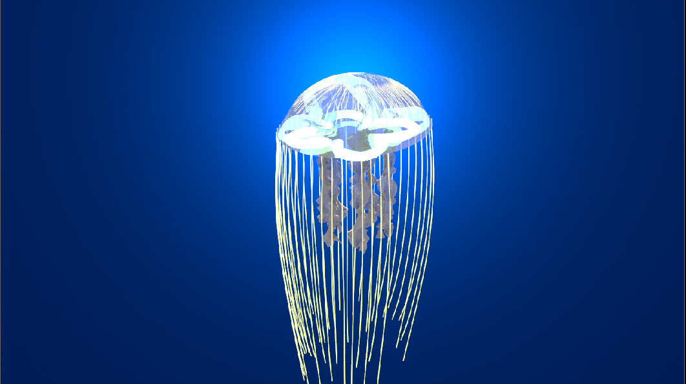
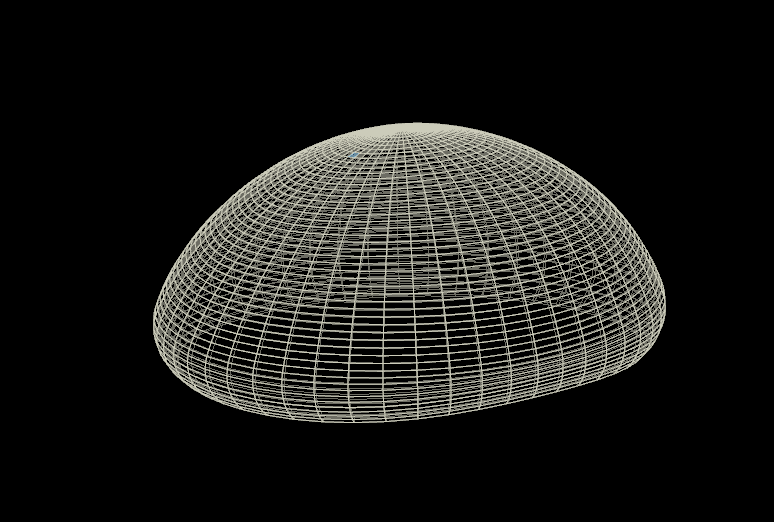
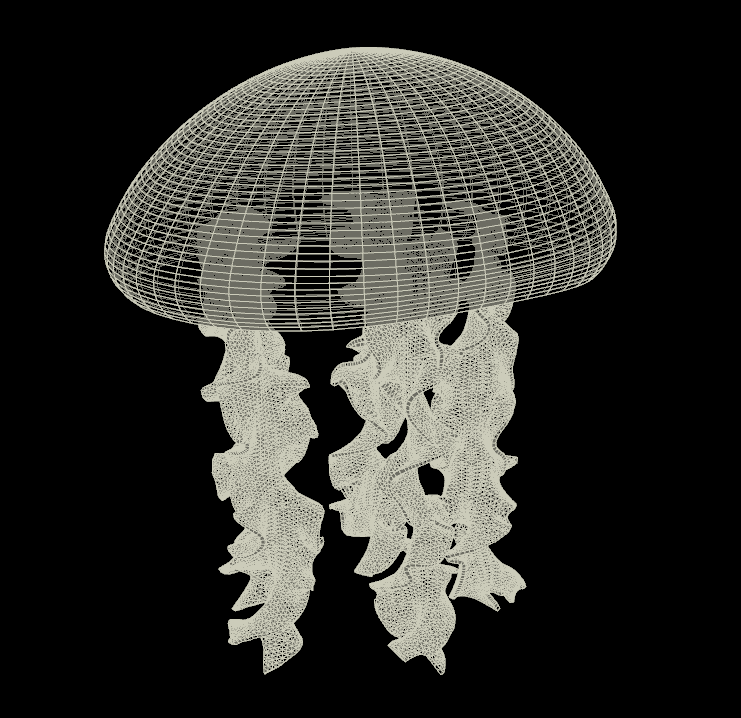
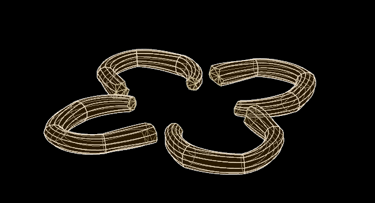
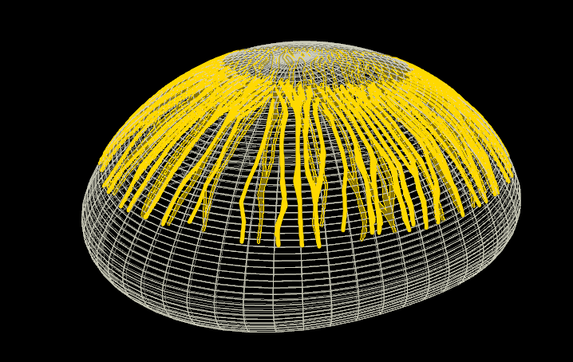
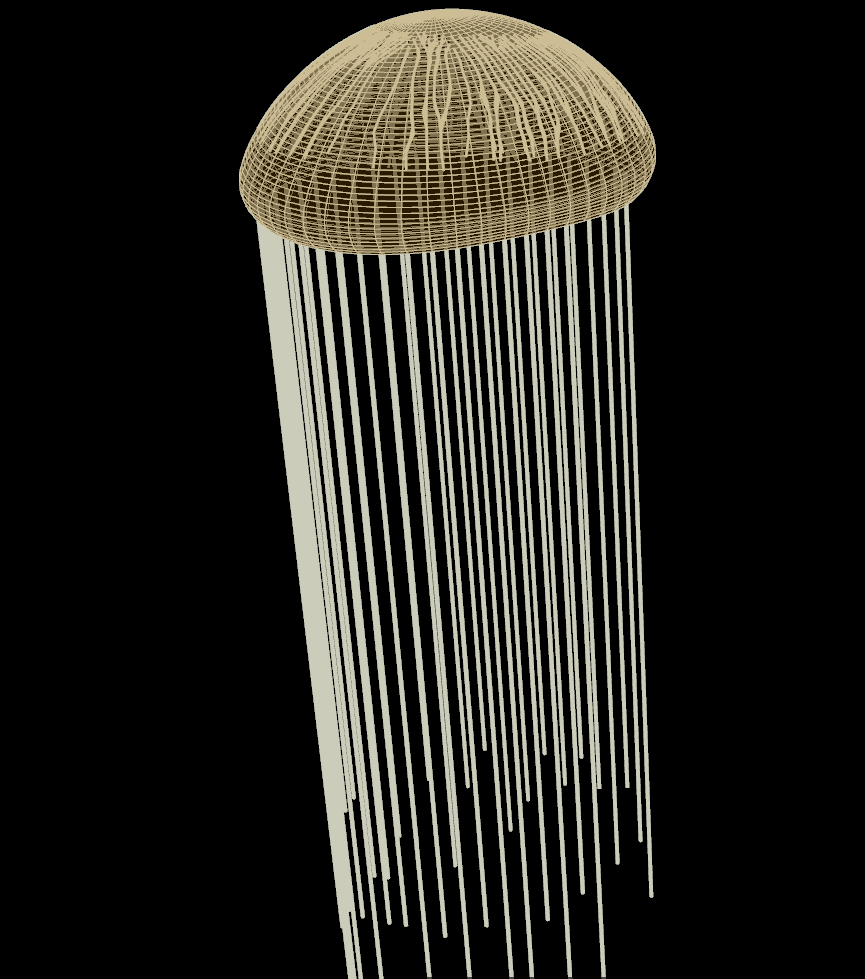

# Late Day Used

# Procedural Jellyfish

## Name: Xiaoyue Ma

## Project Overview

For this project, I created a yellow Jellyfish with an ocean background using Houdini.

Extra: rendering

## Animation Result

## Rendering Result

## Bell

  

The jellyfish's bell is formed by revolving a line with two bends: the upper main and lower bell parts. To add variety, a 'mountain' node introduces noise. Animation is achieved using a Null node to track changing variables like YTransform and bending angles, and is animated using keyframes.

## Arm

  

The elegance of the jellyfish's arms comes from a meticulously twisted grid set on an XY-plane. This surface, kissed by the textures of mountain, attribute wrangle, and remesh, delivers a captivating ruffled look. Upon crafting five exquisite replicas and anchoring them gracefully at the zenith, the magic unfolds. Using the prowess of Vellumsolver combined with the finesse of cloth and pin-to-target Vellumconstraints, the arms dance with an enchanting dynamism, reminiscent of nature's underwater ballet.

#### Organ

  

The jellyfish's organs are sculpted using the sweep node. By melding a custom-designed curve with a circle and accentuating it with our cherished mountain, a uniquely irregular geometry comes to life.

#### Vein

  

The veins, the project's trickiest part, are crafted using the find shortest path node. Starting from selected points atop the Bell and ending at the bottom, the paths are determined. Using the sweep function, these paths are then transformed into veins.

#### Tentacles

  

The mesmerizing tentacles of the jellyfish take form through the astute use of the copytopoints node. Gleaning the Bell's terminal points with the precision of the group range. Enhanced with the unpredictable artistry of attribrandom, these lines undulate with a life of their own, metamorphosing into the tantalizing tentacles. Their delicate dance is orchestrated by the prowess of Vellumsolver, deftly tethered with the finesse of hair constraints, creating an underwater spectacle of elegance and fluidity.

